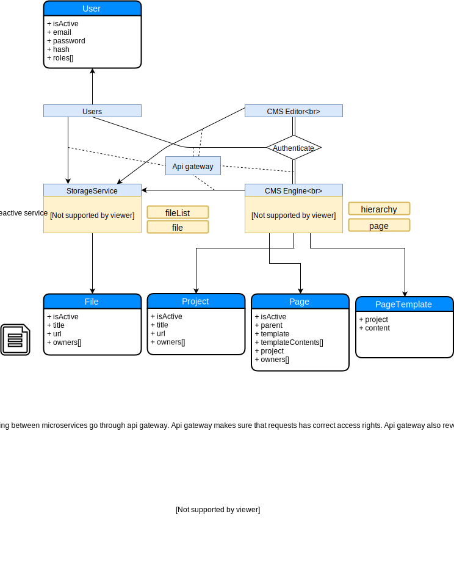

# A microservice CMS system

This project is under heavy development. Project has just started, so there's possibly not much to see yet.

## Architecture

Communication between services is done with http-protocol. System uses gateway approach, and there isn't any additional service discovery systems. Services route every request through gateway, which makes sure requests has needed access rights. Gateway also serves the public api outside. System is meant to be easy to undestand and development.

I can't see need for rpc-communication or more sophisticated service discovery in this system. If arcitecture would be more complicated and there would be lots of small services I definitely would use something like Consul and dump gateway alltogether.

I started this project to learn go, and it may be visible in some choices, but I'm pretty thrilled about the project and who knows if this will evolve to a proper cms system some day.

This is definitely open source. Feel free to use the code as you wish.

Chart:

